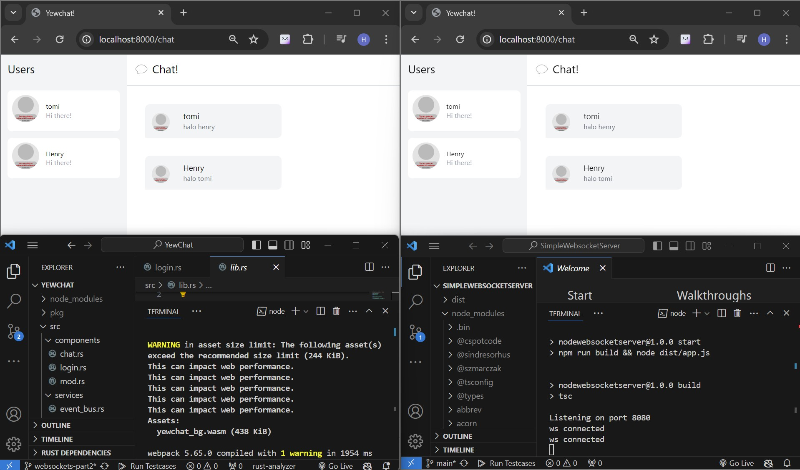
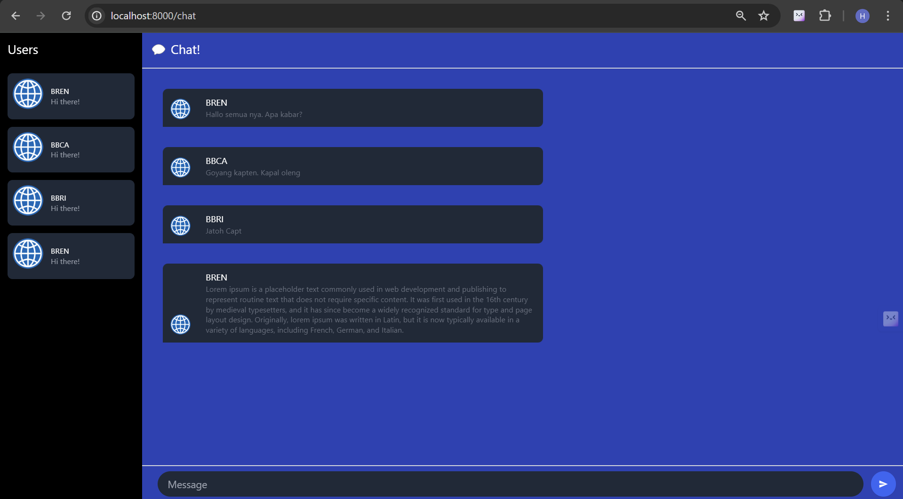

# MODULE 10
## Tutorial 3: WebChat using yew

### 3.1. Original code

## 3.2. Add some creativities to the webclient

Pada commmit ini, saya melakukan beberapa perubahan dari sisi visualisasi. Saya mengubah warna yang monoton menjadi warna biru dan hitam. Warna hitam digunakan sebagai warna latar belakang informasi yang menampilkan pengguna-pengguna yang sedang melakukan chat. Sedangkan warna biru digunakan sebagai warna latar belakang chat(obrolan). Selain itu saya juga mengubah profile picture dengan suatu gambar agar tidak monoton dengan avatar display. Melalui commit ini saya merasa bahwa kreativitas dalam dunia IT sangat diperlukan dalam menghadapi perkembangan jaman di era perkembangan Artificial Intelligence.